<!-- 1. [2022.07.13 (수)](#2022.07.13)
2. [2022.07.14 (목)](#2022.07.14)
3. [2022.07.15 (금)](#2022.07.15)
4. [2022.07.16 (토)](#2022.07.16)
5. [2022.07.17 (일)](#2022.07.17)
6. [2022.07.18 (월)](#2022.07.18)
7. [2022.07.19 (화)](#2022.07.19)
8. [2022.07.20 (수)](#2022.07.20)
9. [2022.07.21 (목)](#2022.07.21)
10. [2022.07.22 (금)](#2022.07.22)
11. [2022.07.24 (일)](#2022.07.24)
12. [2022.07.25 (월)](#2022.07.25)
13. [2022.07.26 (화)](#2022.07.26)
14. [2022.07.27 (수)](#2022.07.27)
15. [2022.07.28 (목)](#2022.07.28)
16. [2022.07.30 (토)](#2022.07.30)
17. [2022.08.02 (화)](#2022.08.02)
18. [2022.08.05 (금)](#2022.08.05)
19. [2022.08.06 (토)](#2022.08.06) -->

# 2022.07.13

블랑 1664

    
    - 도수: 5%
    - 특징: 프랑스 스트라스부르 지방의 작은 양조장에서 시작 되었고 정제수, 맥아, 밀, 글루코오스 시럽, 호프추출물, 오렌지껍질, 고수, 천연향료가 들어간 것이 특징
    - 개인평: 고수향은 그렇게 많이 안 나고 오렌지 껍질 향이 강해서 끝맛이 달달한 맥주라 개인적으로 매우 취향
    - 평점: ★★★★★

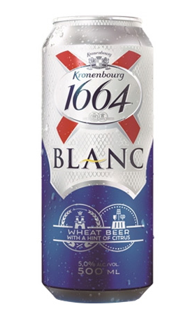
    

# 2022.07.14

테라

    
    - 테라
    - 도수 4.6%
    - 특징: 카스와 마찬가지로 인기가 많은 맥주
    - 개인평: 역시 이런 맥주는 맥주 가게 가서 생맥으로 소맥 말아 먹는게 제일 맛있다
    - 평점: ★★★☆☆
    
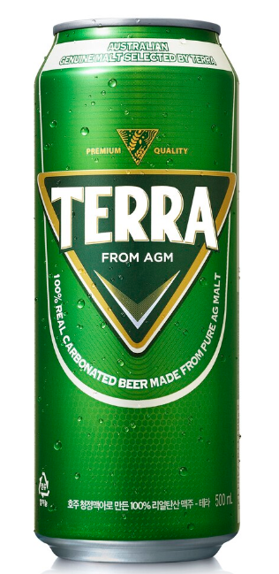

# 2022.07.15

제주 위트 에일 맥주

    - 도수: 5.3%
    - 특징: 제주 감귤 껍질의 상큼함과 섬세한 꽃 향이 나는 맥주
    - 개인평: 귤 껍질 맛이 미세하게 나는 맥주
    - 평점: ★★★☆☆
    
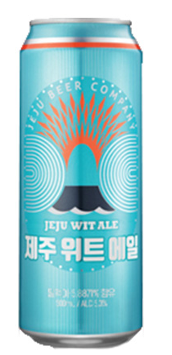

# 2022.07.16

기네스 드래프트 비어

    - 도수: 4.2%
    - 특징: 흑맥주 자체가 조금 기울여두고, 갈색이 검은색으로 바뀌기 시작하는 시점이 가장 맛있는 순간인 만큼 먹는 방법에 따라 맛이 달라지는 맥주
    - 개인평: 귀찮아서 그냥 마셨더니 씁쓸한 맛이 너무 오래 남아서 맛이 없었음.
    - 평점: ★☆☆☆☆
    
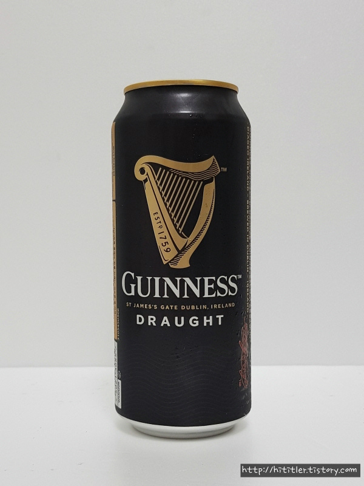

# 2022.07.17

아사히

    - 도수: 5.0%
    - 특징: 일본 맥주이며, 청량하고 끝 맛이 상쾌하다.
    - 개인평: 사실 카스나, 테라랑 비교해서 그렇게 큰 차이가 느껴지지 않으며 가끔 사먹기에 좋은 거 같다
    - 평점: ★★★★☆
    
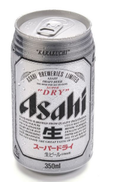

# 2022.07.18

바밤바 막걸리

    - 도수: 4.0%
    - 특징: 일반적인 막걸리보다 도수가 낮고 밤맛이 진하며 달달하다
    - 개인평: 달달하고 맛있지만 끝맛에 조금 이상한 맛이 있다.
    - 평점: ★★★☆☆
    
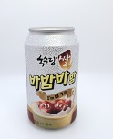

# 2022.07.19

할맥 생맥

    - 도수: ???
    - 특징: 가게에서 마시는 시원한 생맥
    - 개인평: 생맥은 역시 가게에서 직접 마셔야 한다. 시원하고 살짝 블랑과 비슷한 맛이 나서 내 스타일이였다.
    - 평점: ★★★★★
    

# 2022.07.20

클라우드 생 드래프트 맥주

    - 도수: 5%
    - 특징: 탄산이 많은 청량감을 위한 맥주
    - 개인평: 테라, 클라우드, 카스는 눈 가리고 마시면 눈치 못 챌 정도로 맛이 비슷하다 그냥 무난한 맥주
    - 평점: ★★★☆☆

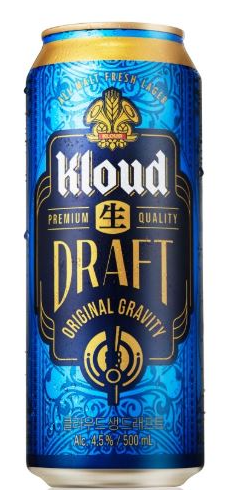
    

# 2022.07.21

기네스

    - 도수: 4.5%
    - 특징: 기네스 드래프트보다 덜 쓰며, 안에 거품을 만드는 볼이 들어있어서 신기하다.
    - 개인평: 기네스 자체가 씁쓸한 맥주라 내 스타일은 아니였다
    - 평점: ★★☆☆☆

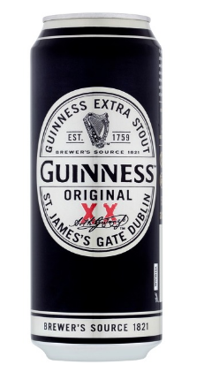
    

# 2022.07.24

순하리 레몬진

    - 도수: 4.5%
    - 특징: 달달한 레몬 맛으로 알콜이 들어간 레모네이드 느낌의 맥주
    - 개인평: 토닉 워터랑 맛이 크게 차이가 없었고, 생각보다 별로였다.
    - 평점: ★☆☆☆☆

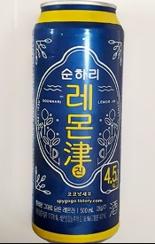
    

# 2022.07.25

Hop House 13

    - 도수: 5.0%
    - 특징: 기네스 회사에서 만든 아일랜드 맥주
    - 개인평: 블랑을 제외하면 제일 맛있다고 해도 과언이 아닐 정도로 맛있었다.
    - 평점:  ★★★★★

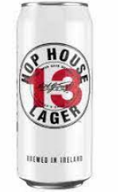
    

# 2022.07.26

호가든 로제

    - 도수: 3.0%
    - 특징: 밀맥주로 라즈베리를 넣어서 만든 로제 맛인게 특징
    - 개인평: 밀맥주 특유의 부드러움은 있으나, 향수를 먹는 맛
    - 평점: ★☆☆☆☆
    
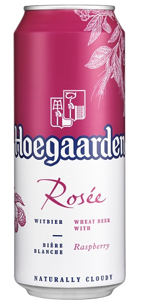
    

# 2022.07.27

호가든 페어

    - 도수: 3.5%
    - 특징: 여름 한정으로 나온 서양배 과즙을 넣은 상큼한 밀맥주
    - 개인평: 배맛은 모르겠고 청포도? 청사과 맛이 나는 맛 개인적으론 달달한게 음료수 느낌이라 맛있었음
    - 평점:  ★★★☆☆
    
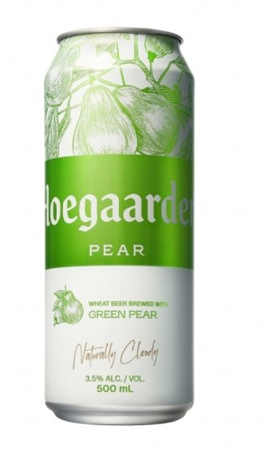
    

# 2022.07.28

호가든

    - 도수: 4.9%
    - 특징: 벨기에 대표적인 밀맥주 중 하나로 밀맥주 특성상 한 번 따르고, 흔들어서 효모(거품)까지 싹 마셔주는게 특징
    - 개인평: 블랑이랑 비교적 비슷한 맛을 내지만 블랑 보단 향이 약해서 완전 내 취향은 아니였다
    - 평점: ★★★★☆
    
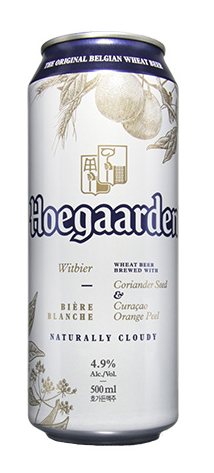
    

# 2022.07.30

호가든 보타닉

    - 도수: 2.5%
    - 특징: 은은한 꽃향기를 담아낸 밀맥주
    - 개인평: 호가든 로제가 향수를 먹는 맛이였다면, 호가든 보타닉은 방향제를 먹는 맛
    - 평점: ★☆☆☆☆
    
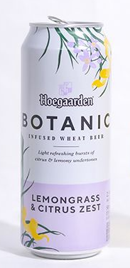
    

# 2022.08.02

광화문

    - 도수: 5.0%
    - 특징: 에일 맥주로 맥문동을 함유해 4주간 상면발효 시킨 맥주
    - 개인평: 씁쓸한 귤 껍질 맛이 나는 맥주, 개인적으로 쓴 맛이 조금 약했으면 좋겠다
    - 평점: ★★☆☆☆
    
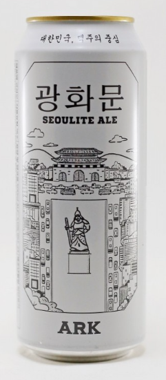
    

경복궁

    - 도수: 5.0%
    - 특징: 광화문 맥주와 제주 백록담 에일을 연이어 출시하면서 수제맥주 열풍에 맞추어 나온 프리미엄 수제 맥주
    - 개인평: 광화문을 먹고 먹어선 모르겠지만 굉장히 맛있음
    - 평점: ★★★☆☆
    
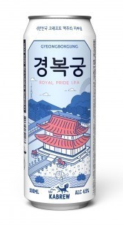
    

# 2022.08.05    

OB라거

    - 도수: 4.6%
    - 특징: 옛날에 굉장히 유명했던 맥주로, 뉴트로 열풍으로 다시 판매중인 맥주
    - 개인평: 막 엄청 맛있다는 느낌은 안 들었지만 진짜 시원하게 다시 마시면 생맥주 느낌이 나서 맛있을 거 같았다
    - 평점: ★★★☆☆
    
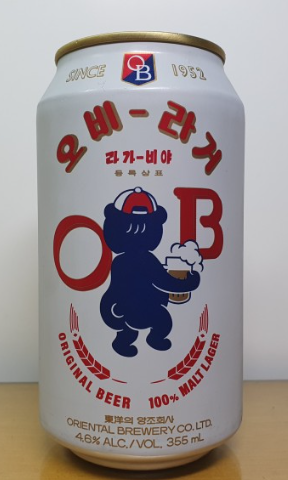
    

# 2022.08.06   

한맥

    - 도수: 4.6%
    - 특징: 쌀을 담아 만든 맥주로, 부드럽고 깔끔한 풍미의 팟이 일품인 맥주
    - 개인평: 야구장에서 다 식은 맥주를 마셔서 그런지 무슨 맛인지 하나도 모르겠다 (나중에 다시 먹어보든 해야할 듯)
    - 평점: ★★☆☆☆
    
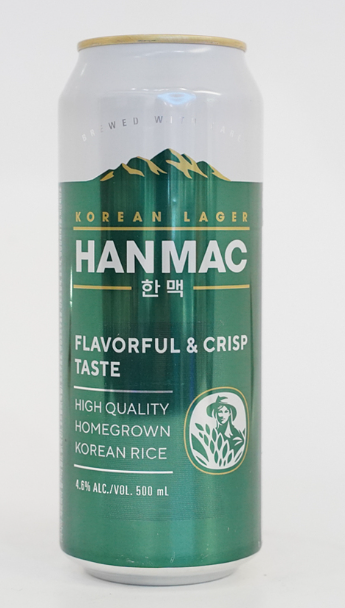

# 2022.08.09

성산일출봉 에일

    - 도수: 5.1%
    - 특징: 제주 맥주 중 나온 하나로 독일의 맥주 순수령 기준에 부합하게 만들어짐
    - 개인평: 일반적인 맥주 맛이였는데 의외로 쓴 맛이 강했다 하지만 맛이 독특해서 또 먹어볼만함
    - 평점: ★★★☆☆
    
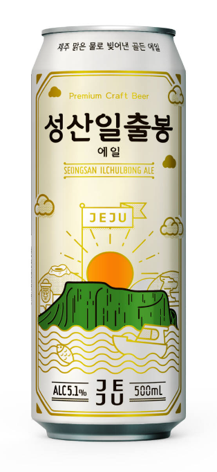
    

# 2022.12.15

매화수 (초록병)

    - 도수: 12%
    - 특징: '저온 냉동 여과공법'을 사용해 부드럽고 깨끗한 맛!
    - 개인평: 매실 음료를 먹는 맛 맛은 있고 도수도 적당히 있어서 기분이가 좋아지는 맛
    - 평점: ★★★★☆
    
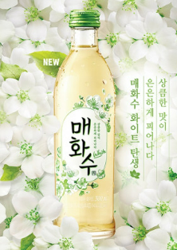
    

# 2022.12.16

버드와이저

    - 도수: 5%
    - 특징: 버드와이저는 발효액을 저온에서 7~12일 가량 발효시킨 후, 다시 0℃ 이하에서 1~2개월가량 숙성시킨 라거
    - 개인평: 사실 무슨 특징이 있는지는 모르겠는데 카스나 테라에서 나는 특유의 맥주 맛이 나지 않고 깔끔해서 좋았다
    - 평점: ★★★★☆
    
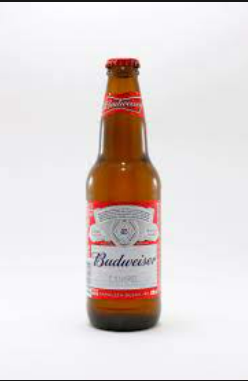
    

# 2022.12.17

원소주

    - 도수: 24%
    - 특징: 술맛이 깔끔하고 목 넘김이 부드럽다. 감압증류(대기압보다 낮은 압력에서 증류)한 술의 특징이다
    - 개인평: 소주보단 비싸고 사케보단 싼마이가 나는 맛 개인적으로 이 돈 좀 더 모아서 사케 먹을 듯
    - 평점: ★★☆☆☆
    
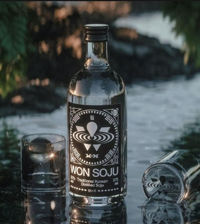
    

# 2023.01.04

산토리 프리미엄 몰츠

    - 도수: 5.5%
    - 특징: 일본 최고의 맥주 중 하나로 손꼽히며 홉 향이 매우 진하고 쓴 맛과 단 맛이 강조 된 맥주
    - 개인평: 생맥주로 바로 마셔서 그런지 같이 먹었던 안주가 맛있었는지 모르겠지만 생각보다 괜찮은 맥주
    - 평점: ★★★★☆
    
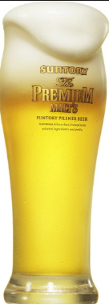
    

# 2023.01.04

화요 25

    - 도수: 25%
    - 특징: 제법상 증류식 소주이기는 하나 가양주로 전승된 것이 아니라 증류식 소주라는 개념만을 사용해 현대적으로 만들어낸 술
    - 개인평: 도수가 있는거라 그런지 목넘김이 있고 요즘 이런 강한게 좋아서 그런지 굉장히 맛있었음
    - 평점: ★★★★☆
    
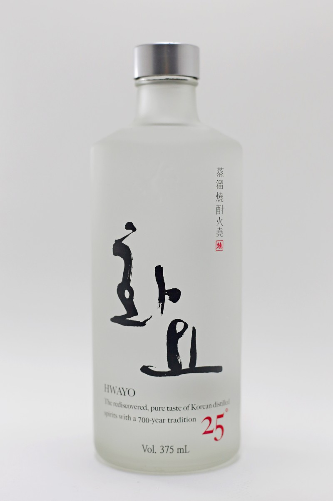
    

# 2023.01.20

별빛청하 스파클링

    - 도수: 7%
    - 특징: 일반적인 청하에 탄산과 화이트 와인을 섞어 목넘김과 적절한 단맛이 있는 술
    - 개인평: 그냥 대놓고 맛있으라고 만든 술이라 맛이 없을 수가 없었다 대신에 가격 대비 양이 좀 적었음
    - 평점: ★★★☆☆
    
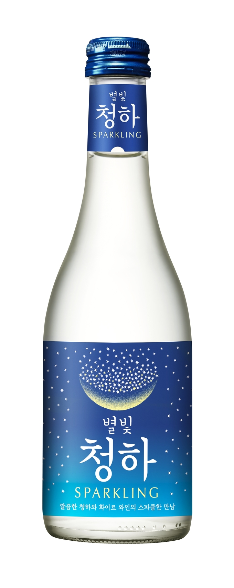
    

# 2023.01.24

화요 41

    - 도수: 41%
    - 특징: 제법상 증류식 소주이기는 하나 가양주로 전승된 것이 아니라 증류식 소주라는 개념만을 사용해 현대적으로 만들어낸 술
    - 개인평: 그냥 한 번 마시면 내 위장이 속 위치를 알 수 있는 술. 굉장히 뜨겁게 목넘김이 묵직하고 입 안에 향이 오래 남아 있는다. 개인적으로 그 느낌이 괜찮았음
    - 평점: ★★★★☆
    
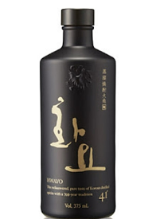
    

# 2023.02.04

와일드 터키

    - 도수: 50%
    - 특징: 공개된 매시빌은 옥수수 75%, 호밀 13%, 맥아 12%이며, 여타 버번보다 호밀 비율이 높다는 것을 자체적으로 강조한다
    - 개인평: 온더락에 얼음을 넣어 먹어도 맛있었지만, 샷으로 먹었을 때 남는 향은 진짜 지워지지 않을 정도로 즣은 향이였다
    - 평점: ★★★☆☆
    
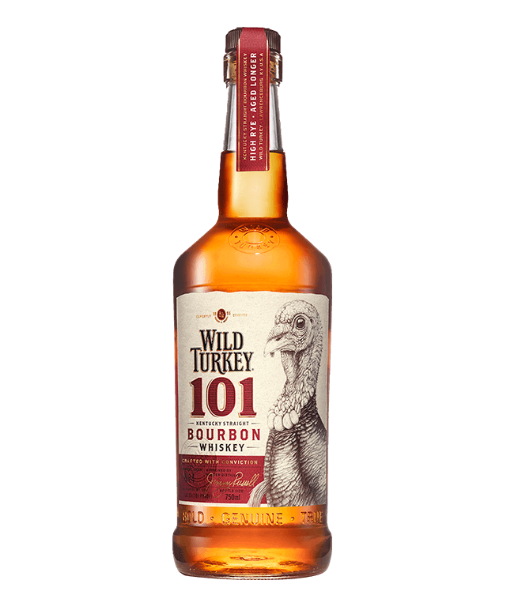
    

# 2025.01.22

녹차와리

    - 상품명: お茶割り
    - 도수: 4.0%
    - 종류: 소주
    - 특징: 일본 소주에 녹차를 탄 술 소주를 희석 시켜 도수가 낮고 알콜 쓴 맛도 많이 나지 않는다
    - 개인평: 맥주인 줄 알고 샀다가 후회 했고, 소주맛이 안 나지만 그걸 상외 하는 녹차의 쓴 맛이 쓴 맛을 다시 한 번 부활시킨 창의적으로 맛이 없는 맛
    - 평점: ★☆☆☆☆
    
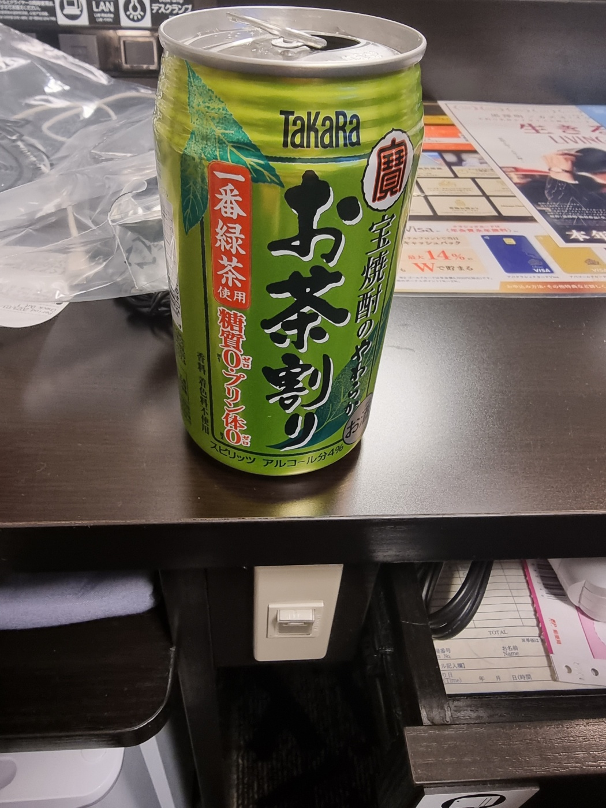
    

호로요이 (시로이사와)

    - 상품명: ほろよい 白しろいサワー
    - 도수: 3.0%
    - 종류: 하이볼
    - 특징: 산토리에서 생산 중인 츄하이 중 하나로, 음료처럼 달콤한 맛이 특징
    - 개인평: 그냥 밀키스 맛이고, 알콜이나 이런 건 느껴지지 않는다. 모든 술이 그렇겠지만 식으면 별로
    - 평점: ★★★★☆
    
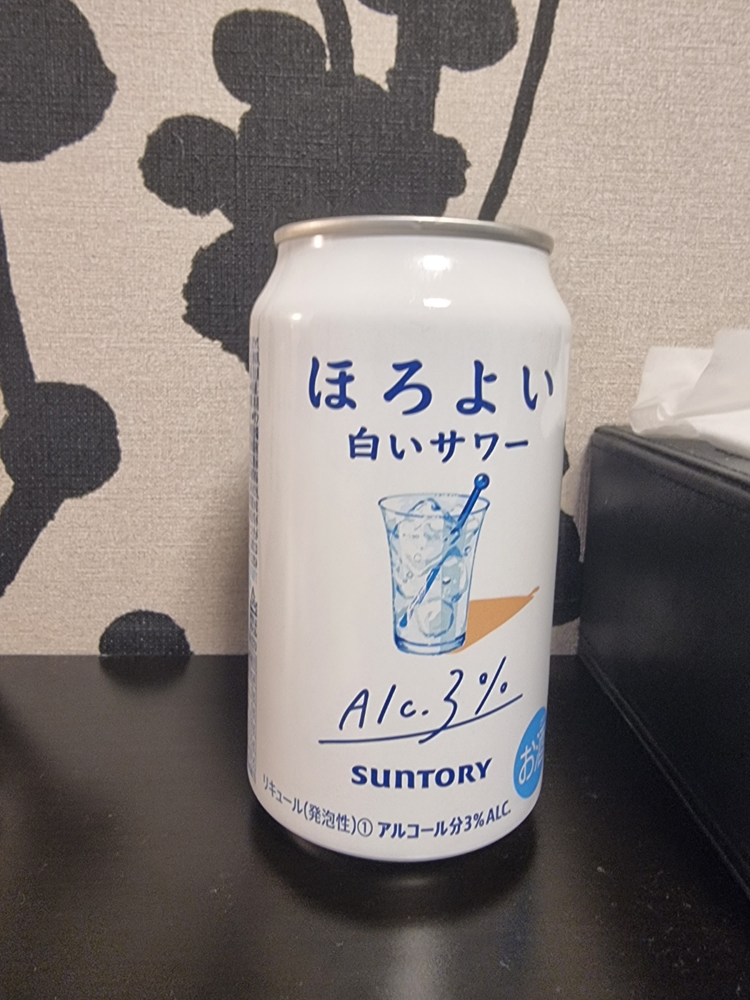
    

산토리 금맥

    - 상품명: Suntory 金麦
    - 도수: 5.0%
    - 종류: 맥주
    - 특징: 금색 보리를 뜻하며, 가벼운 느낌으로 즐기기 좋은 맥주
    - 개인평: 한국에서 따지면 카스나 테라 같은 느낌이였으나, 그것보다 탄산이 강하고 보리맛이 강한 맛 그냥 평범하게 즐기기 좋은 거 같다
    - 평점: ★★★☆☆
    
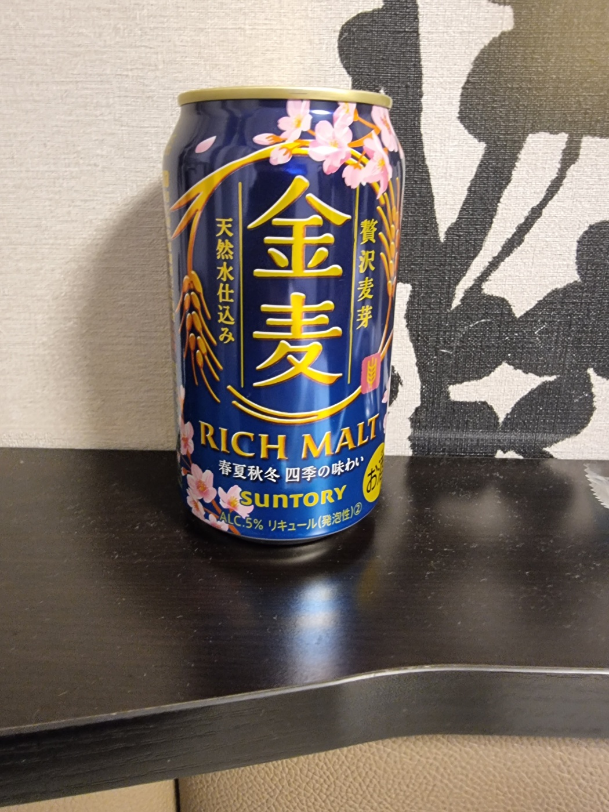
    

아사히 아사히 사치 짜기 자몽

    - 상품명: アサヒ アサヒ贅沢搾りグレープフルーツ
    - 도수: 4.1%
    - 종류: 하이볼
    - 특징: 아사히에서 만든 자몽 맛 하이볼 자몽을 1/2개 이상의 과즙을 사용 하였다.
    - 개인평: 자몽 하이볼 맛 딱 그 정도인데 자몽 좋아하면 먹을만 하고 아니면 애매한 맛
    - 평점: ★★☆☆☆
    
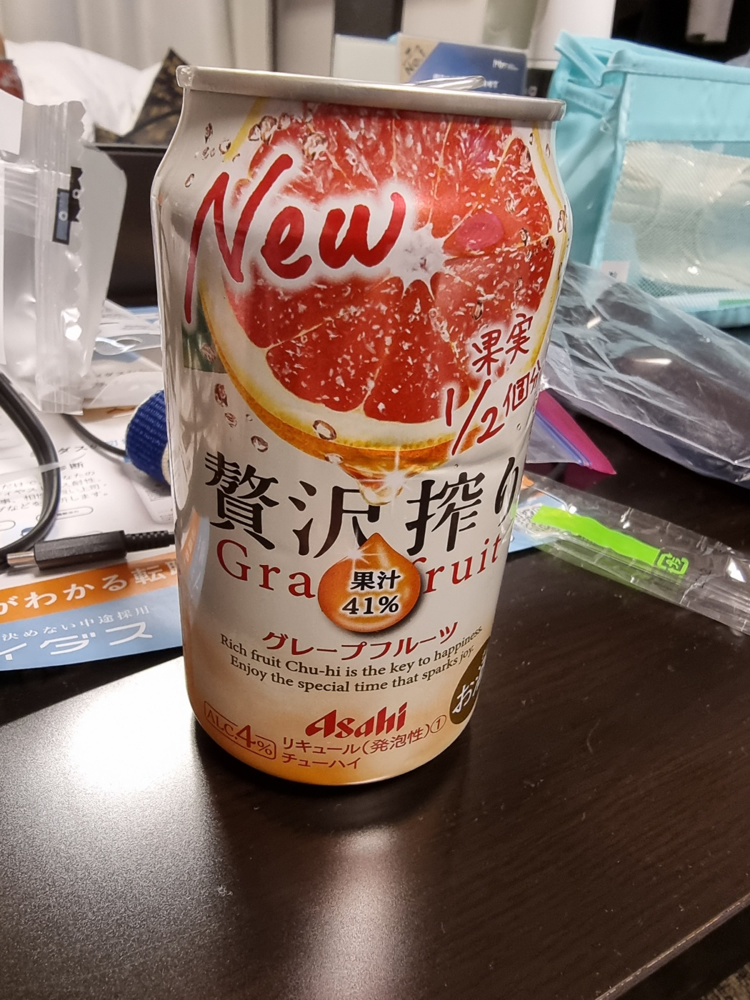
    

버팔로 트레이스

    - 상품명: Buffalo Trace
    - 도수: 45%
    - 종류: 위스키
    - 특징: 전통적인 버번으로 손꼽히는 3대 버번 위스키 중 하나를 자리잡고 있는 위스키 (입문용으로 좋다고 함)
    - 향: 바닐라 보단 나무나 카라멜 향이 많이 났으며, 괜히 버번 3대장이라고 하는 게 아닌 거 같은 버번 하면 떠오를 향이 남
    - 맛: 높은 도수와는 다르게 순한 맛이였고 무난한 나무 맛
    - 개인평: 와일드터키 이후로 먹어보는 위스키였고 콜라에 타먹거나 탄산수에 먹거나 등 다양한 방법으로 즐겼고 무난하게 사두고 마시기 좋은 술
    - 평점: ★★★★☆
    
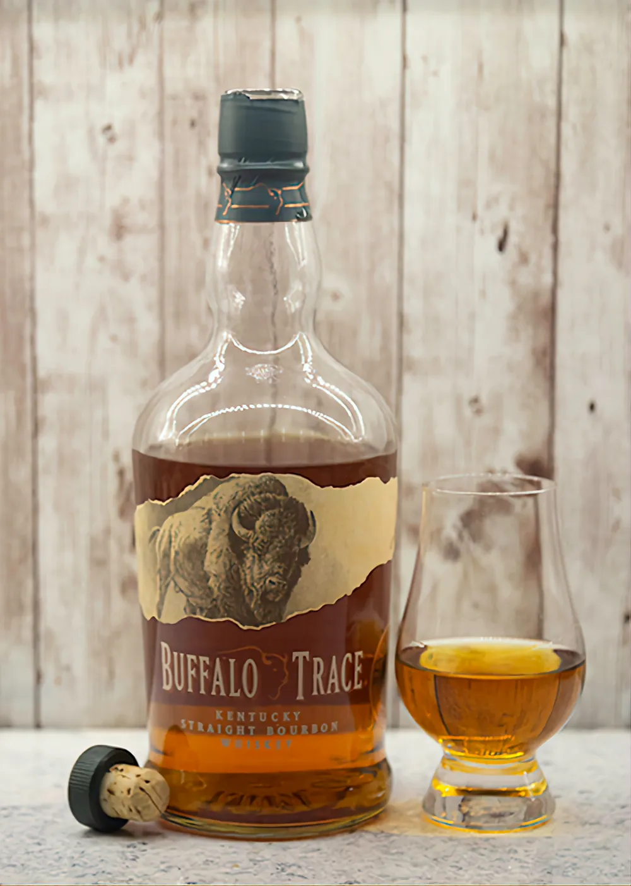
    

메이커스 마크

    - 상품명: Maker's Mark
    - 도수: 45%
    - 종류: 위스키
    - 특징: 전통적인 버번으로 손꼽히는 3대 버번 위스키 중 하나이며, 그 중 대표라고 볼 수 있다
    - 향: 나무와 캬라멜 향이 나며, 좀 독한 느낌이 났음
    - 맛: 실제로 독한 맛이 났고, 그 와중 버번 위스키에서 나는 특유의 스파이시한 맛이 나지 않았음
    - 개인평: 이렇게 3대 위스키를 전부 먹어 봤는데 왜 입문용으로 좋다고 하는지 알 거 같은 클래식한 맛이였고 그러면서도 전부 특색이 있었음
               개인적으로는 버팔로 트레이스 -> 와일드 터키 -> 메이커스 마크 순으로 맛있는 듯
    - 평점: ★★☆☆☆
    
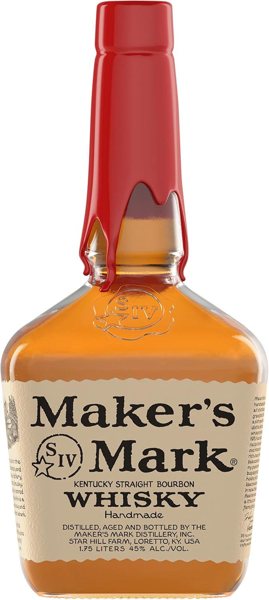
    

글렌리벳 12

    - 상품명: THE GLENLIVET 12yo
    - 도수: 40%
    - 종류: 위스키
    - 특징: 글렌리벳 중 대표적인 제품 중 하나로 과장을 보태면 스카치 위스키의 상징이라고도 불림
    - 향: 글렌리벳 특유의 과일 향이 강하게 나며 지금까지 먹었던 버번 위스키들과는 다르게 부드럽고 가벼운 향이 남 
    - 맛: 향과 동일하게 스파이시한 맛은 나지 않고 은은하게 나는 과일맛과 그러면서 알콜에서 오는 독한 맛이 꽤나 인상적이였음 
    - 개인평: 내가 산 건 아니였지만 가격적으로 부담이 없고 취향만 맞으면 집에 두고 두고 먹어도 될 듯 함
    - 평점: ★★★☆☆
    
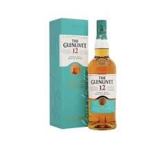
    

블랑톤

    - 상품명: Blanton's
    - 도수: 46.5%
    - 종류: 위스키
    - 특징: 최초의 싱글 배럴 버번이기도 하며, 부드러우면서도 진한 느낌이 남
    - 향: 바닐라 향과 함께 캬라멜 냄새가 강해서 알콜이나, 위스크 특유의 독한 냄새는 딱히 나지 않음
    - 맛: 바닐라 향과 달달한 냄새와는 다르게 나무 맛이 나며 끝에는 스파이시한 느낌이 입안을 타격 해주고 마지막에는 입 안에 은은하게 남아 있는 나무 맛이 일품
    - 개인평: 처음으로 내 돈 주고 산 위스키라 어쩔 수 없이 애착이 가며, 병의 생김새부터 맛 까지 전부 내 취향과 일치 하는 몇 안 되는 위스키
    - 평점: ★★★★★
    
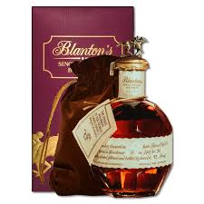
    

라가불린 16

    - 상품명: Lagavulin 16yo
    - 도수: 43%
    - 종류: 위스키
    - 특징: 라가불린을 대표하는 제품으로 인지도가 높은 아일라 피트 위스크의 전형을 보여주는 것으로 명성이 높다.
    - 향: 버번이나 쉐리에선 맡아보지 못 한 새로운 향이 났고 뭐라 말로 형용하기 어려움...
    - 맛: 맛 또한 향과 비슷하게 뭐라 형용하기 어렵고... 굳이 비유 하자면 과학실에서 먹는 물 맛..?
    - 개인평: 근데 의외로 끝맛이 나쁘지 않았고, 약 맛이 나는 것 같지만 또 약은 아닌 뭔가 설명하기 어려운 맛
            하지만 사람들이 왜 피트에 빠지는지 알만한 매력이 있었고, 기회 되면 한 병 정도는 마련 해도 괜찮을 듯 함
    - 평점: ★★☆☆☆
    
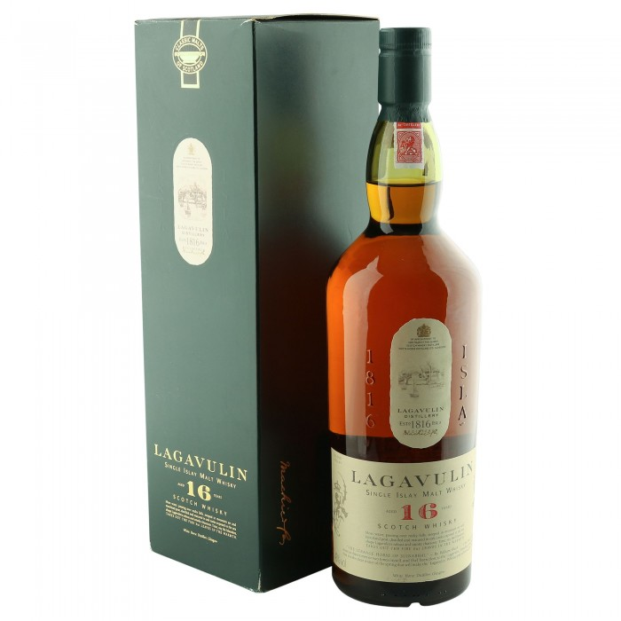
    

# 2025.01.23

에반윌리엄스 12

    - 상품명: Blanton's
    - 도수: 46.5%
    - 종류: 위스키
    - 특징: 최초의 싱글 배럴 버번이기도 하며, 부드러우면서도 진한 느낌이 남
    - 향: 바닐라 향과 함께 캬라멜 냄새가 강해서 알콜이나, 위스크 특유의 독한 냄새는 딱히 나지 않음
    - 맛: 바닐라 향과 달달한 냄새와는 다르게 나무 맛이 나며 끝에는 스파이시한 느낌이 입안을 타격 해주고 마지막에는 입 안에 은은하게 남아 있는 나무 맛이 일품
    - 개인평: 처음으로 내 돈 주고 산 위스키라 어쩔 수 없이 애착이 가며, 병의 생김새부터 맛 까지 전부 내 취향과 일치 하는 몇 안 되는 위스키
    - 평점: ★★★★★
    

    

로얄브라클라 12

    - 상품명: Blanton's
    - 도수: 46.5%
    - 종류: 위스키
    - 특징: 최초의 싱글 배럴 버번이기도 하며, 부드러우면서도 진한 느낌이 남
    - 향: 바닐라 향과 함께 캬라멜 냄새가 강해서 알콜이나, 위스크 특유의 독한 냄새는 딱히 나지 않음
    - 맛: 바닐라 향과 달달한 냄새와는 다르게 나무 맛이 나며 끝에는 스파이시한 느낌이 입안을 타격 해주고 마지막에는 입 안에 은은하게 남아 있는 나무 맛이 일품
    - 개인평: 처음으로 내 돈 주고 산 위스키라 어쩔 수 없이 애착이 가며, 병의 생김새부터 맛 까지 전부 내 취향과 일치 하는 몇 안 되는 위스키
    - 평점: ★★★★★
    

    

글렌리벳 18

    - 상품명: Blanton's
    - 도수: 46.5%
    - 종류: 위스키
    - 특징: 최초의 싱글 배럴 버번이기도 하며, 부드러우면서도 진한 느낌이 남
    - 향: 바닐라 향과 함께 캬라멜 냄새가 강해서 알콜이나, 위스크 특유의 독한 냄새는 딱히 나지 않음
    - 맛: 바닐라 향과 달달한 냄새와는 다르게 나무 맛이 나며 끝에는 스파이시한 느낌이 입안을 타격 해주고 마지막에는 입 안에 은은하게 남아 있는 나무 맛이 일품
    - 개인평: 처음으로 내 돈 주고 산 위스키라 어쩔 수 없이 애착이 가며, 병의 생김새부터 맛 까지 전부 내 취향과 일치 하는 몇 안 되는 위스키
    - 평점: ★★★★★
    

    

닙크릭 라이

    - 상품명: Blanton's
    - 도수: 46.5%
    - 종류: 위스키
    - 특징: 최초의 싱글 배럴 버번이기도 하며, 부드러우면서도 진한 느낌이 남
    - 향: 바닐라 향과 함께 캬라멜 냄새가 강해서 알콜이나, 위스크 특유의 독한 냄새는 딱히 나지 않음
    - 맛: 바닐라 향과 달달한 냄새와는 다르게 나무 맛이 나며 끝에는 스파이시한 느낌이 입안을 타격 해주고 마지막에는 입 안에 은은하게 남아 있는 나무 맛이 일품
    - 개인평: 처음으로 내 돈 주고 산 위스키라 어쩔 수 없이 애착이 가며, 병의 생김새부터 맛 까지 전부 내 취향과 일치 하는 몇 안 되는 위스키
    - 평점: ★★★★★
    

    

발베니 12 (싱글 우드)

    - 상품명: Blanton's
    - 도수: 46.5%
    - 종류: 위스키
    - 특징: 최초의 싱글 배럴 버번이기도 하며, 부드러우면서도 진한 느낌이 남
    - 향: 바닐라 향과 함께 캬라멜 냄새가 강해서 알콜이나, 위스크 특유의 독한 냄새는 딱히 나지 않음
    - 맛: 바닐라 향과 달달한 냄새와는 다르게 나무 맛이 나며 끝에는 스파이시한 느낌이 입안을 타격 해주고 마지막에는 입 안에 은은하게 남아 있는 나무 맛이 일품
    - 개인평: 처음으로 내 돈 주고 산 위스키라 어쩔 수 없이 애착이 가며, 병의 생김새부터 맛 까지 전부 내 취향과 일치 하는 몇 안 되는 위스키
    - 평점: ★★★★★
    

    

