## 시작글

---

전에 나고야를 2박 3일로 가서 아쉬웠지만 그 사실을 망각하고 이번엔 후쿠오카 2박 3일 여행 일지

가서 딱히 할 건 없었지만 드디어 돈미새 모임이랑 여행을 갈 수 있다는 기대감에 날짜와 일정은 고려하지 않은 막무가내 여행

무엇보다 난 입사한지 얼마 안됐고 전효은 박도형 김형민 전부 연차가 별로 없어서 길게 여행 일정을 잡기 어려운 감이 있었다.. 심지어 허진호 이 놈은 지가 특강 들어야 한다고 도망 가놓고 정작 다른 특강 날은 놀러 간다고 수업을 안 들었다 하 ;;

## 여행 준비

---

추가로 오늘부터 적히는 블로그는 딱딱하게 적기 보단 조금 스타일을 바꿔서 적어볼 예정,
어차피 여행이기도 한데 너무 딱딱하게 적는 거 같아서 다나까 보단 음슴체나 요로 끝내볼듯

일단 여행 준비는 크게 한 건 없었음, 어차피 가서 할 것도 없었고 비행기랑 숙소만 맞으면 그 뒤에 일정을 알아서 짤 거 같다고 생각했음

근데 문제는 뭐, 어딜 가자고 말해도 답장이 잘 돌아오지 않는 문제 덕분에 숙소를 정할때도 쉽지 않게 정했었는데 뭐 아무튼 어찌 저찌 잘 정해졌으니까... 넘어가도록 하자.. 음음...

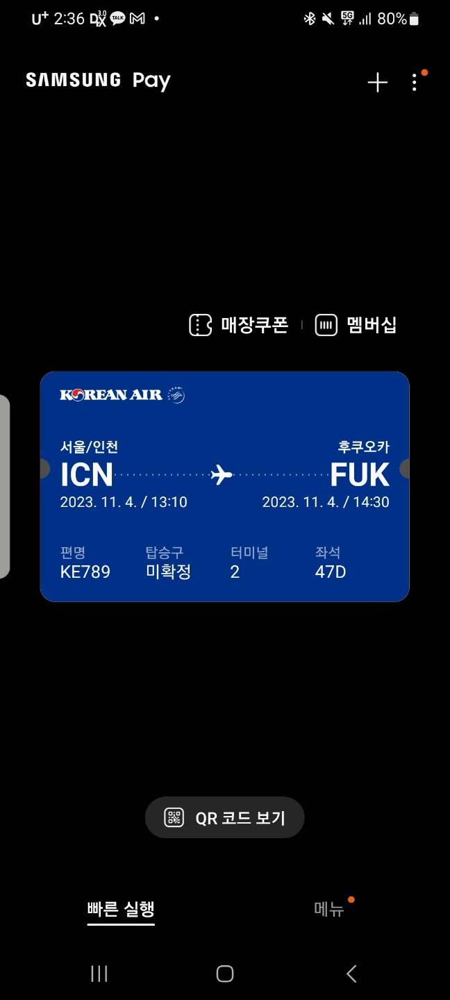

그리고 가격이 제일 싼 항공편이 무려 대한항공이였다! 내가 살면서 일본 갈 때 대한항공 같은 거대한 항공사를 타고 갈거라곤 생각도 못 했는데 ! 아무튼 엄청 신기했다

## 11.04 (토)

---

- 날씨: 맑음(대한민국), 맑음(일본)

### 출발

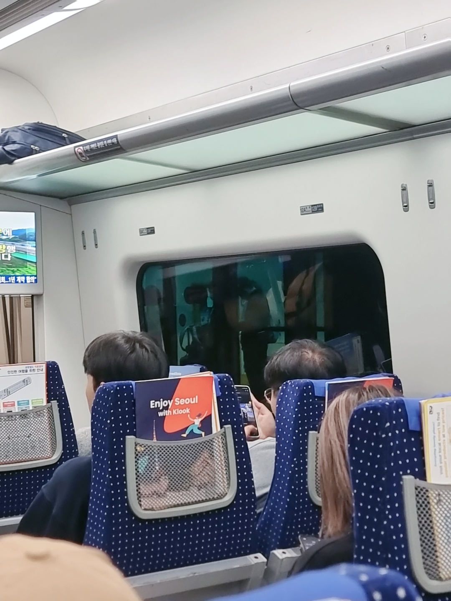
공항철도 같이 타고 가는 형민이와 도형이 뒷통수 안 탄다고 할 줄 알았는데 타자고 하니까 같이 타고 갔음

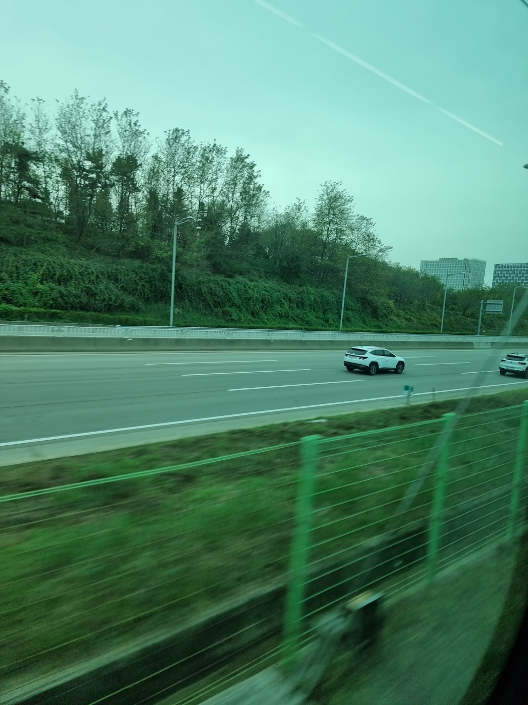
가는길에 생각나서 찍은 사진 어찌 공항철도 타고 갈 때 마다 찍는 거 같다 솔직히 좀 이쁜 걸로 찍지...

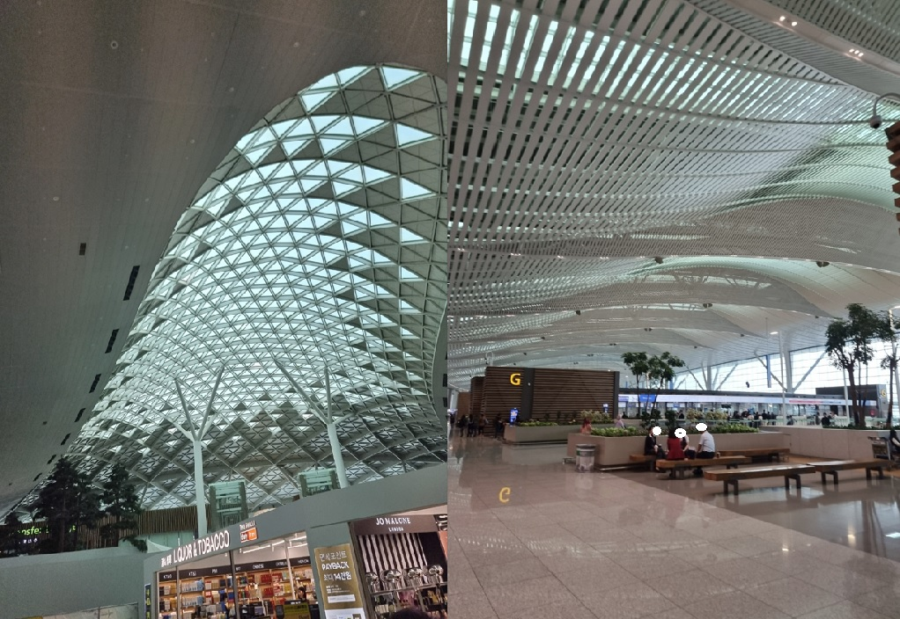
드디어 인천 공항 도착 대한항공은 제 2터미널이라 진짜 오랜만에 와봤어요 진짜 초중학생 때 말고 한 번도 안 타본 거 같았어서 완전 기대중인 상태 간만에 비행기 탄다고 설렘 :D

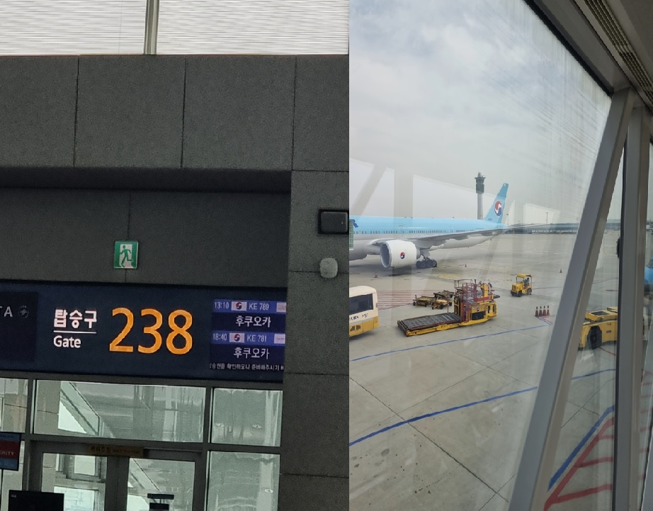
보이시나요? 터미널에 적힌 "(대한항공 마크)후쿠오카"가? 찾아보니까 대한항공에서 작은 비행기는 일본 같이 가까운 곳 갈 때 싸게싸게 파는 경우가 많다고 하는데 그래도 처음에 타는거라 설레더라구요

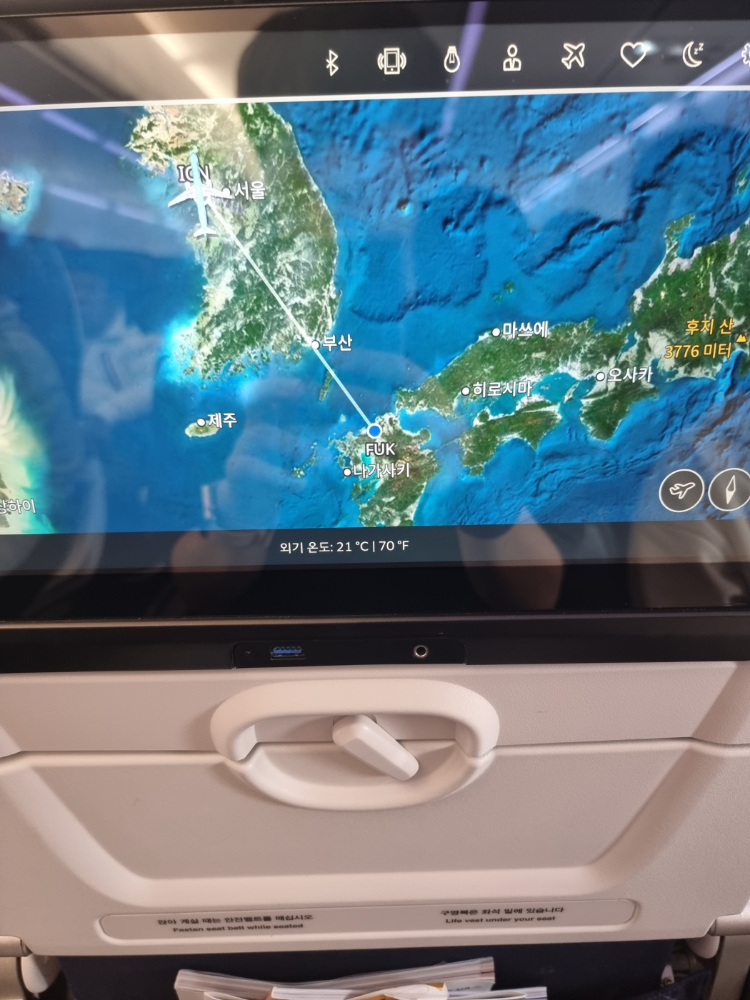
대한항공은 무려 의자마다 저런 화면이 존재하는데 그걸로 자기가 어디까지 왔는지 날씨라든지 영화나 다양한 티비 프로그램을 시청 할 수가 있었어요 솔직히 일본 가기엔 사치라고 생각...

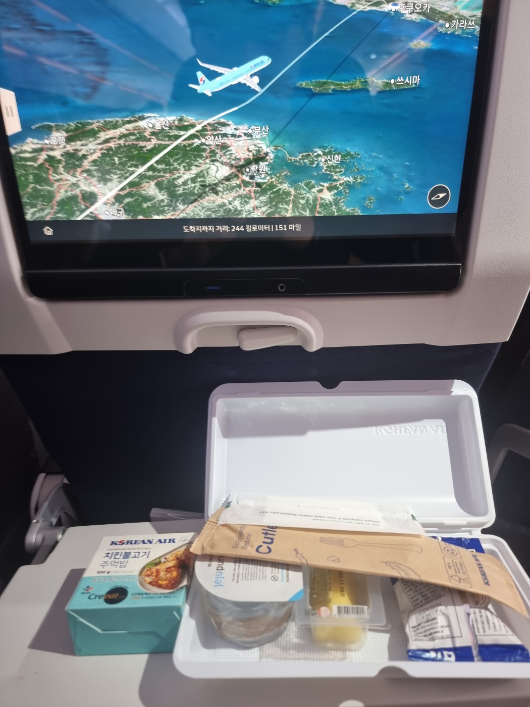
그리고 대한항공은 따로 신청하지 않아도 기내식을 준비해준답니다 
물론 이걸 일본 갈 때도 줄거라고 생각 못 하고 점심을 먹어버렸지만 기내식은 못 참지 ! 하면서 기내식도 다 먹어버렸슴다

### 도착

공항철도 부터 설렘을 숨기지 못하고 후쿠오카에 도착 하자마자 사진부터 찍었어요

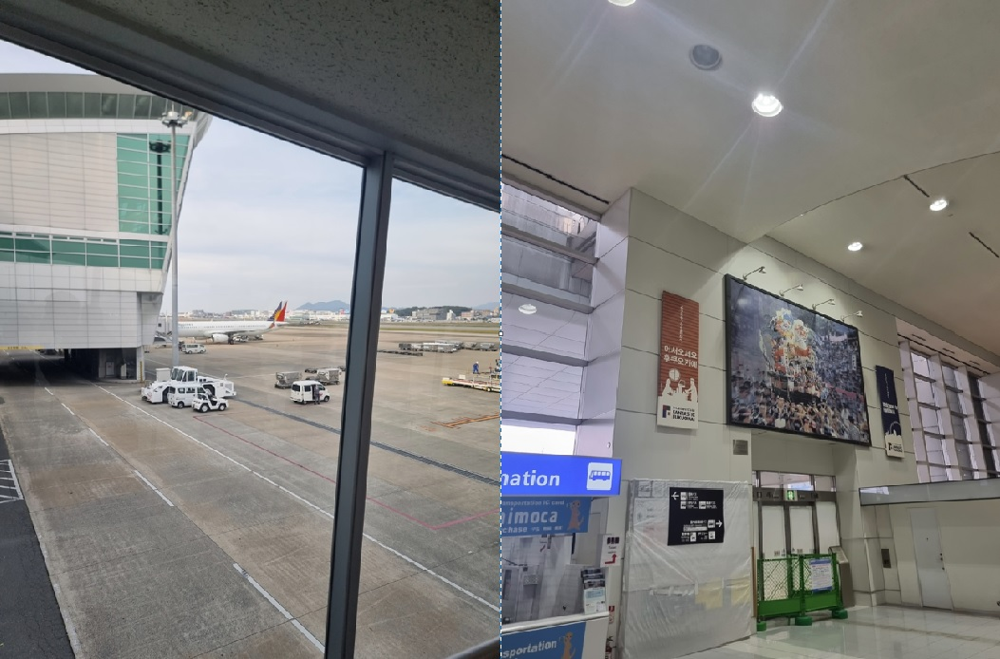
솔직히 말 안 하고 보면 인천 공항이랑 다를건 없지만 제가 다른 곳인걸 알고 있으니 괜찮습니다 !

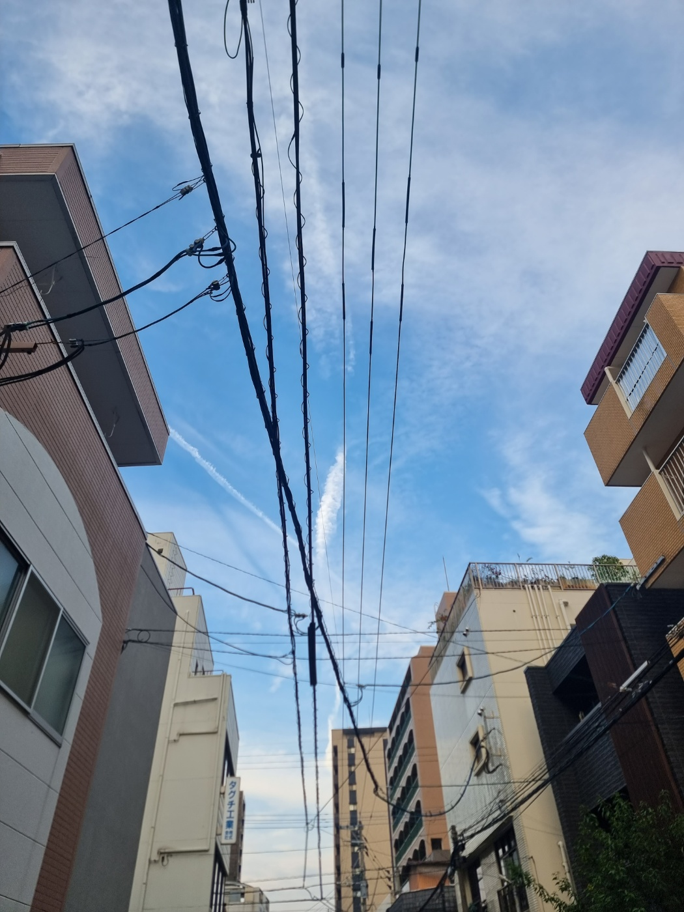
길 가다가 하늘이 너무 맑아서 참지 못 하고 찍었습니다 솔직히 사진을 잘 찍거나 그런 편은 아니라 그냥 생각나면 찍어요

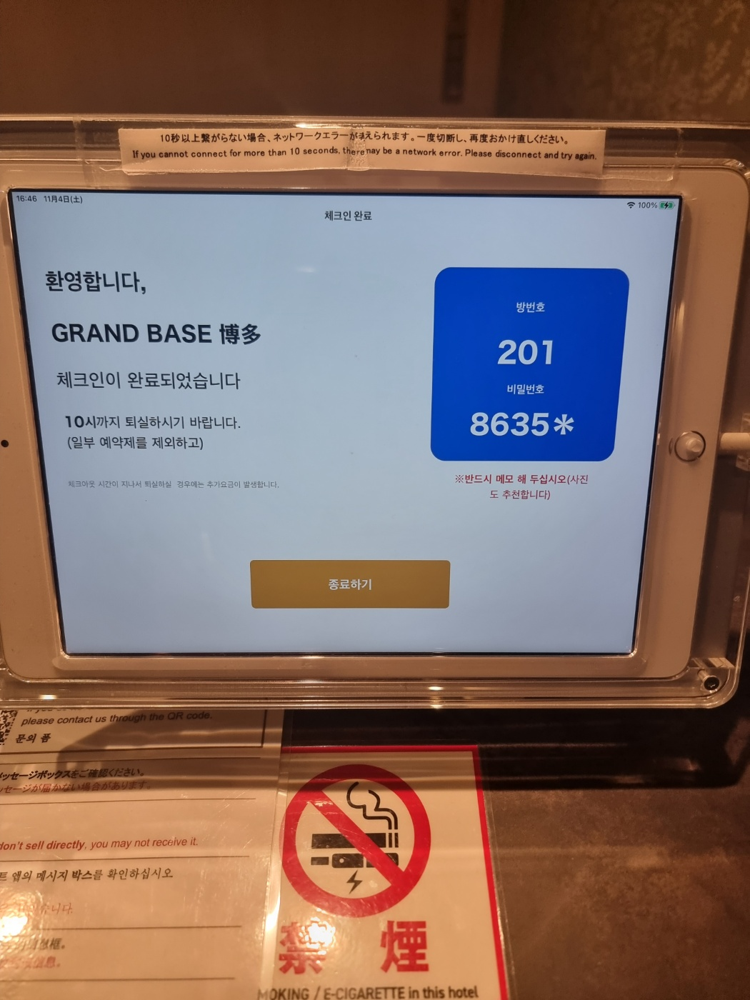
아무튼 숙소 체크인까지 해주고 첫 날 목적인 온천을 즐기러 가봅니다

### 온천

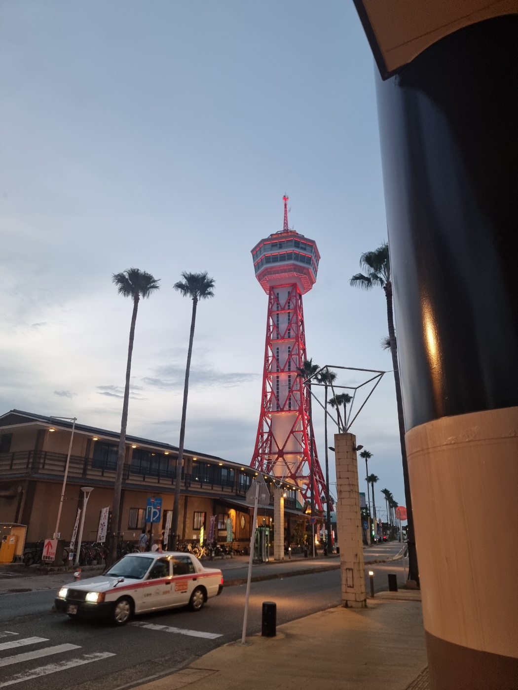
이것도 생각나서 찍었던 풍경이에여 참고로 저 사진에 있는 타워 밑에가 첫 날에 가서 놀았던 온천 입니다 ! 스포지만 굉장히 만족스러웠어요 :D
숙소에서 가까웠던 곳이라 두세번은 더 가고 싶었는데 시간도 안 맞고 갈 일도 없어서 포기 했던 곳...

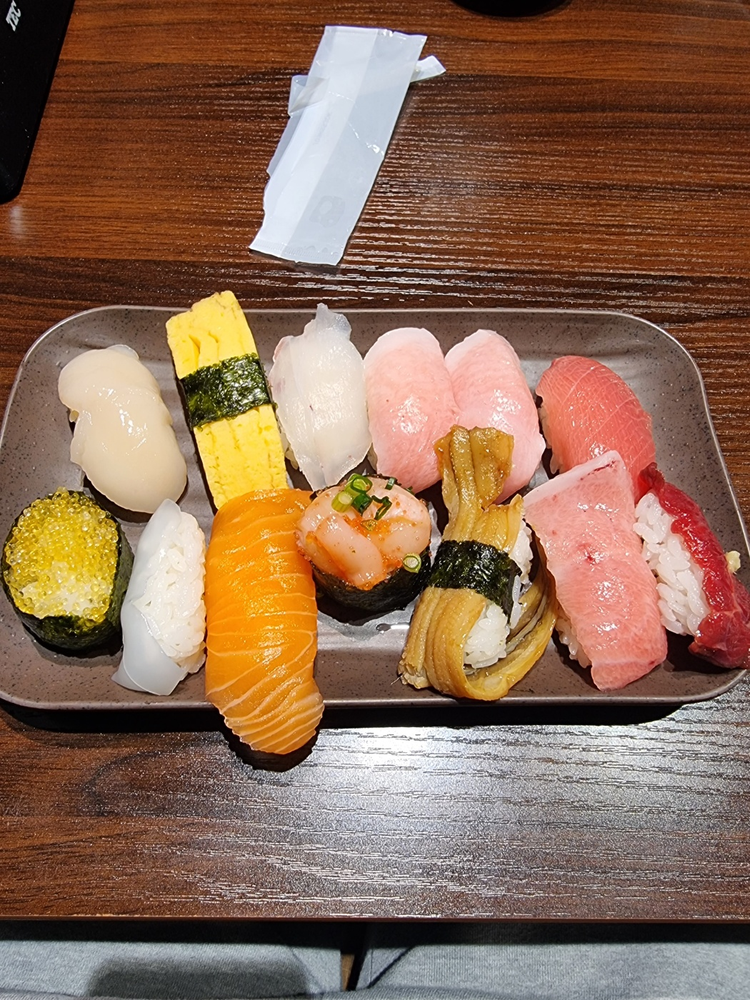
온천을 가기 전에 찾아봤던 가성비 초밥 가게 여기는 진짜 운이 좋았던게 우리까지가 마지막 손님이였고 그 뒤에 손님은 웨이팅이나 포장해갔어야 했는데 진짜 운이 좋았어요

가게 시스템은 그냥 접시 하나를 들고 먹고 싶은 초밥을 담은 후 그거에 맞게 계산을 하면 되는 거였는데 접시에 다 담고 직원을 부르면 지원이 와서 하나하나 더해서 계산을 해준다.

솔직히 엄청 힘들어보였지만... 일단 초밥 가격이 엄처 저렴했고 맛은 당연히 상상 이상으로 맛있어서 만족스러운 저녁이였다

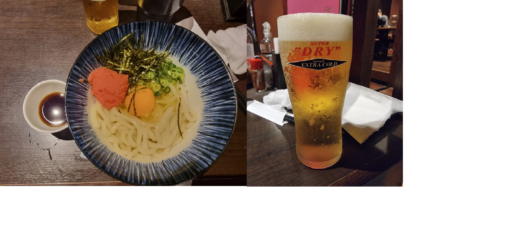
이거는 온천을 끝내고 나와서 아주 조금 출출한 마음을 달래기 위해서 사먹었던 명란 우동과 생맥주 솔직히 온천 그렇게 즐겨놓고 나와서 생맥 하나 안 먹으면 서운하지 않겠어요?
아님 말고...ㅇㅇ.....

무튼 후쿠오카 온천 대충 찾아보고 간거였지만 진짜 진짜 진짜 만족스러웠고 사진을 찍진 못 했지만 온천을 끝내고 나오니 우유 자판기가 있길래 바로 사먹었습니다 :D

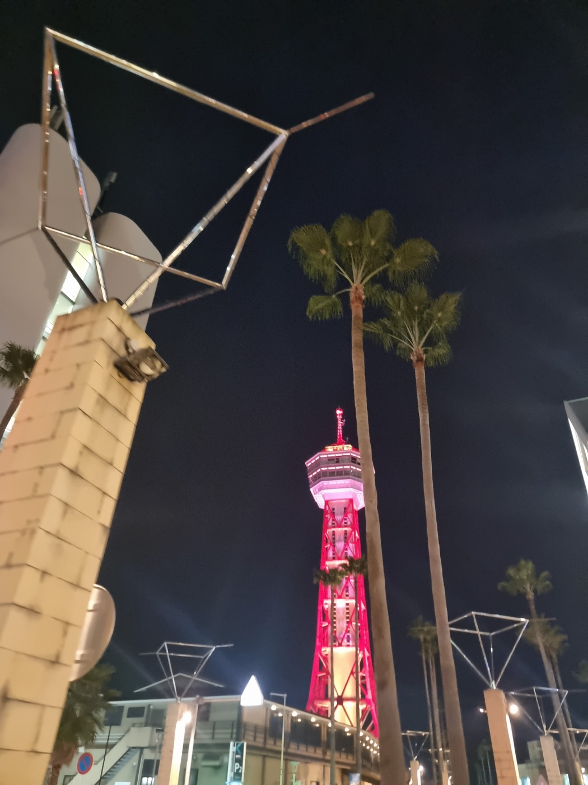
이거는 온천을 다 즐기고 나와서 찍은 후쿠오카 경치, 그냥 낮에 찍었으니까 밤에도 찍고 싶었던 거 같아요

### 야식

솔직히 첫 날 오후에 도착하니 할 것도 없었고, 그냥 온천에 초밥 우동만 먹고 들어가서 자기엔 하루가 너무 아까워서 편의점에서 야식을 사먹었습니다 무엇보다 일본 편의점 야식이 진짜 맛있는데 안 먹고 참을 수가 없었어요

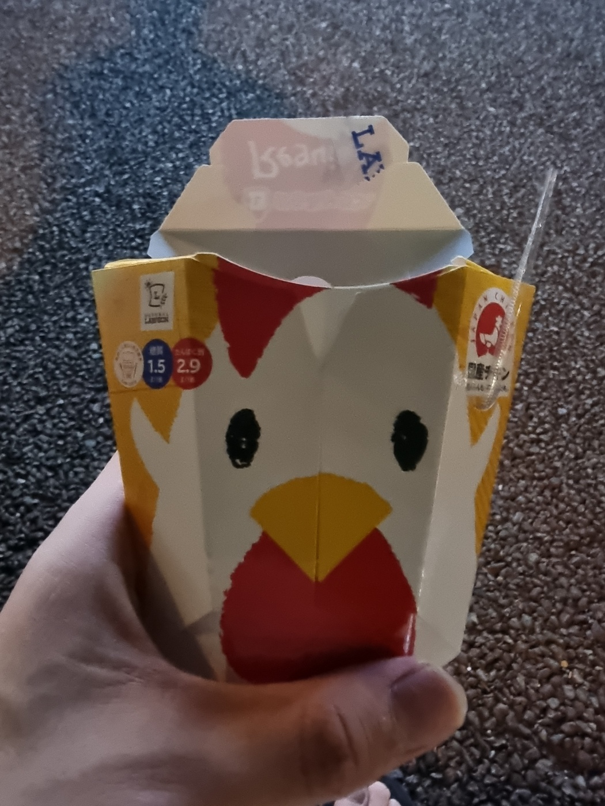
이건 로손에서 사먹은 편의점 치킨인데 이게 진짜 너무 맛있어요 이거 일본 올 때 마다 무조건 먹는듯 평소에도 치킨을 좋아하지만 간도 엄청 강하고 한국에서 먹는 거 처럼 눅눅한 기름 맛도 안나서 일본에서 길거리 음식으로 제일 즐겨 먹는 듯 아무튼 이건 강추함 !

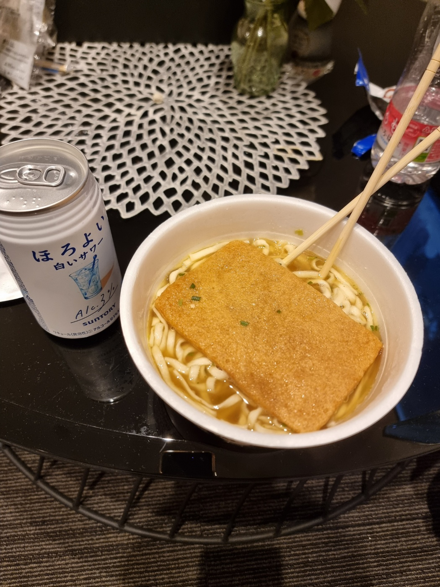
형민이가 자기가 보는 방송인이 진짜 맛있다고 추천해준 라멘 사실 저는 라멘은 좋아하지만 일본에서 파는 컵라멘은 별로 좋아하지 않아요 일본 컵라멘은 그 특유의 MSG 맛이 강해서 뭔가 감칠맛을 넘어선 과학적인 맛이 많이 나요... 근데 저 컵라멘은 맛은 다른거랑 똑같았지만 제일 큰 유부가 머금고 있는 육수맛이 진짜 맛있었어요 솔직히 저 유부만 팔면 먹을 의향 있습니다 (유부 사요)

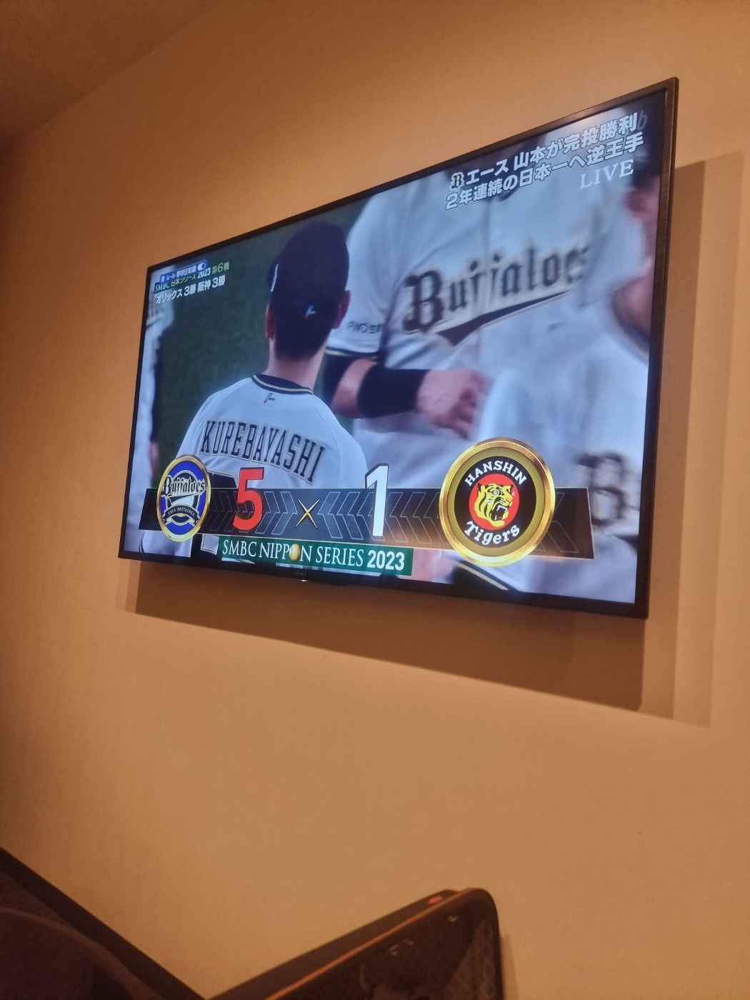
마침 이 때 일본에선 재팬시리즈 중이였는데 오릭스와 한신의 1위를 다투는 경기였어요 ! 이 때 당시에 일본 야구에 대한 관심이 별로 없었는데 이 경기에서 야마모토 요시노부 라는 선수가 완봉승을 해주었고 그걸 보고 일본 야구는 진짜 낭만 넘친다고 생각 했습니다 조만간 일본 야구도 특정팀을 응원 해보려고 정하는 중이에요

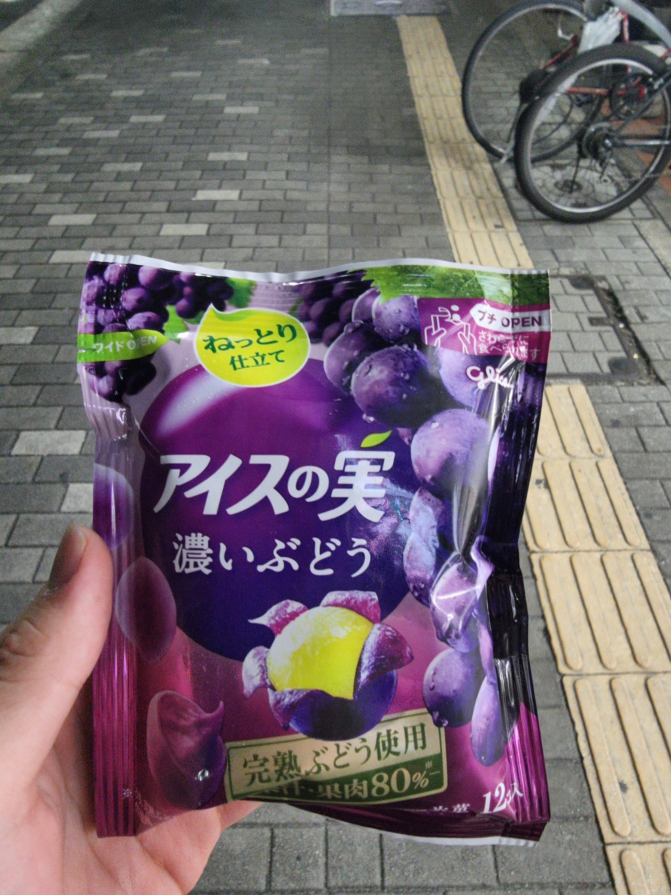
이건 진짜 마지막으로 아이스크림이 먹고 싶어서 주변 편의점에서 사 온 포도맛 아이스크림 내용물은 대충 쪼매만 알맹이들이 하나씩 들어있는데 이게 진짜 맛있어요 일본 갈 때 마다 하나씩 사먹는 중

### 첫 날 마무리

솔직히 초밥에 온천에 우동에 마지막 야식까지 너무 완벽한 하루였다.

오후에 도착해서 반나절만 즐긴거라고는 믿지 못 할 정도에 알찬 하루였고 사진은 없지만 숙소도 넓고 깨끗한데다가 침대도 인당 하나씩 쓸 수 있다는 점이 정말로 좋았다.

추가로 야마모토의 피칭은... 정말 잊지 못 할 것...

## 11.05 (일)

---

- 날씨: 맑음(일본)

## 아침

오늘은 아침에 차장님이 부탁하셨던 CD를 사러갈거에요

솔직히 파는지도 모르고 어디서 파는지도 모르지만 우리에겐 구글 지도가 있으니 걱정이 없었어요 근데 !!!! 결론적으론 CD 안 팔아서 못 샀습니다 ㅎㅎ;

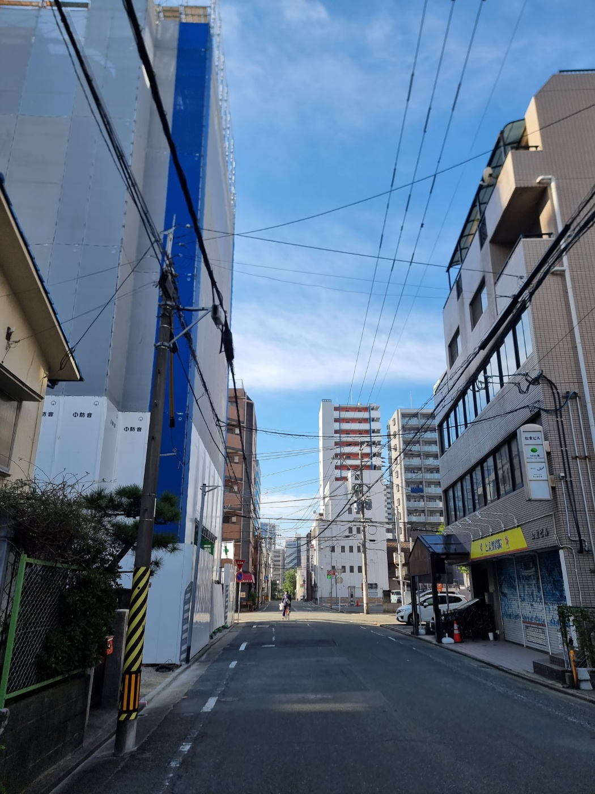
근데 솔직히 날이 너무 좋아서 괜찮다고 생각했어요 하늘도 이쁘고 날도 좋고 심지어 이 때 11월이라 춥지도 덥지도 않고 날씨도 완벽했습니다

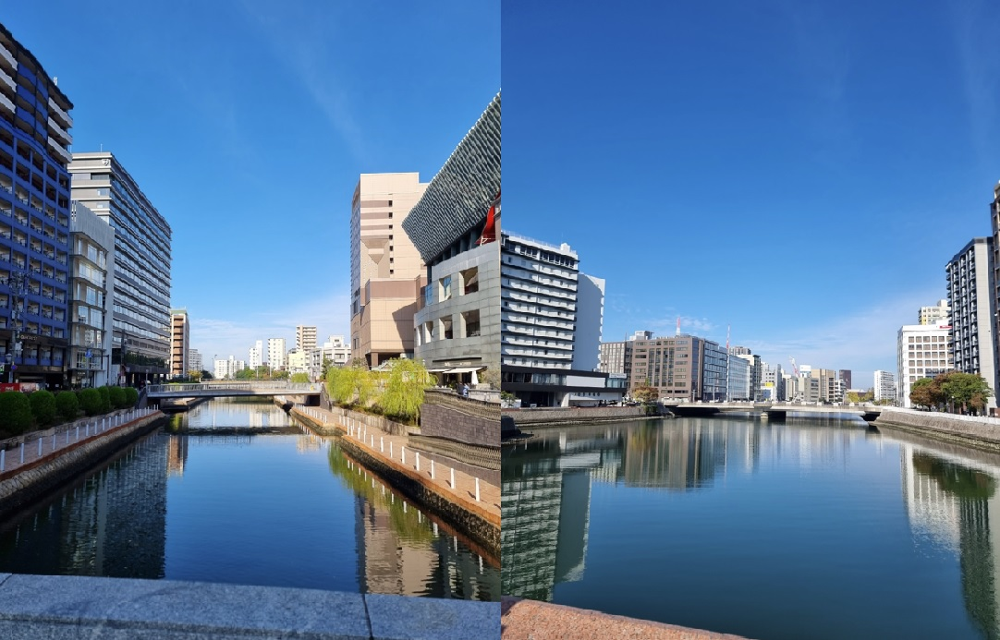
어디서 사진을 찍어도 잘 찍히고 하늘은 맑고 심지어 가는 길 도중에 이런 강이 있는데 서울에서 보이는 산책로랑은 전혀 다른 느낌이였어요 완전 이뻤습니다.

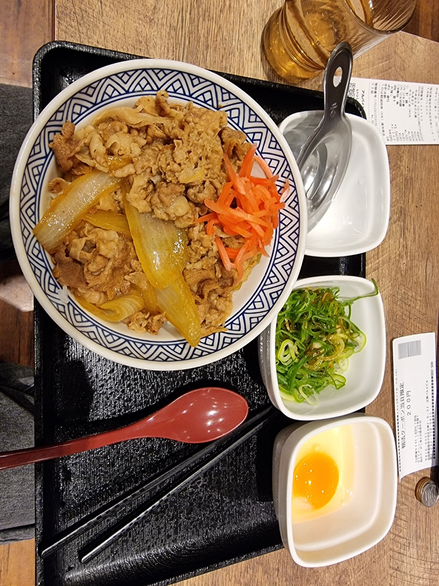
결국 차장님이 부탁하신 CD는 구매하지 못 하고 일찍 일어난 김에 아침이나 먹으러 왔습니다
아 그리고 이 날 아침에 형민이를 끌고 나와서 같이 다녔는데 대충 찾은 맛집 치고 형민이랑 저랑 둘 다 만족 했습니다

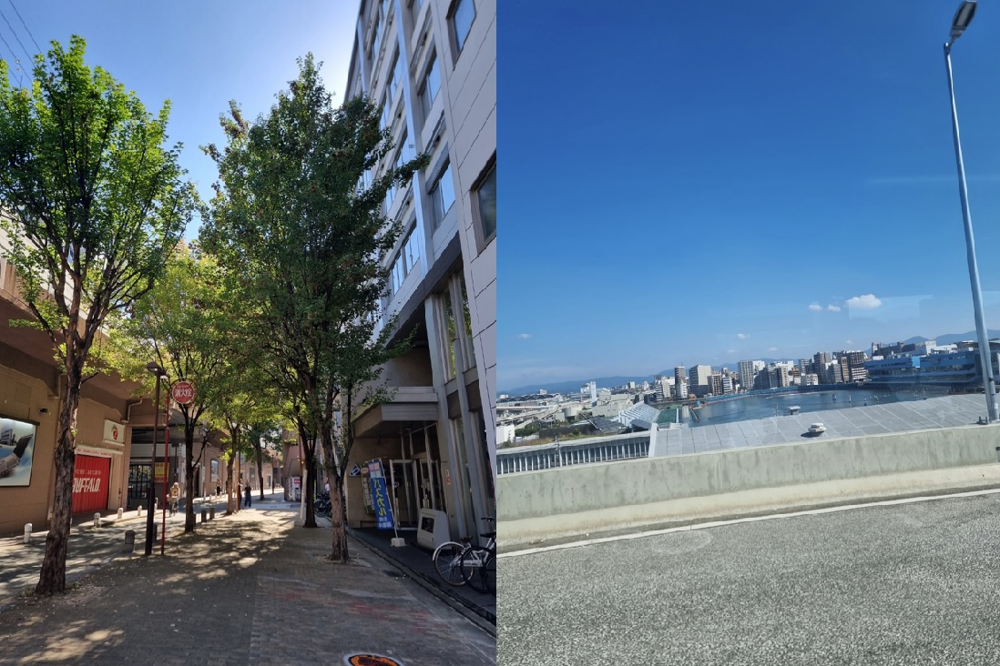
아침을 먹고 점심 일정을 위해 이동 중입니다. 솔직히 저거 전에 아점을 먹고 가기로 했는데 도형이랑 효은이가 지각해서 못 먹었어요 물론 나랑 형민이는 아침 먹어서 그나마 다행이라고 생각...

### 야구장

오늘의 점심 일정은 페이페이돔 구경입니다

솔직히 이 날 할 게 없어서 고민중이였는데 형민이가 페이페이돔에서 이벤트를 한다는걸 찾아와서 호다닥 예약하고 즐기러 갔다

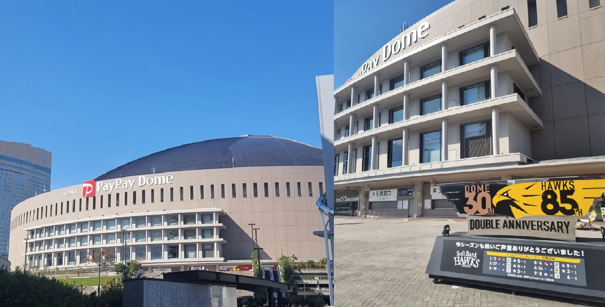
진짜 외관으로는 누가 봐도 페이페이돔이였고 일본 야구장은 이번이 두 번째 방문이지만 서울에 있는 돔들과는 차원이 다른 웅장함이 있다.... 가자마자 아무 생각 없이 돔을 두바퀴 돌았음...

그리고 이제 페이페이 돔 이벤트 예약 시간이 다가와서 예약한 곳으로 호딱 넘어갔다

원래는 박물관도 구경하고 이것저것 체험한건 많은데 이유는 모르지만 찍은 사진이 없다......
아쉬운대로 야구장 사진으로 만족 하도록 하자...

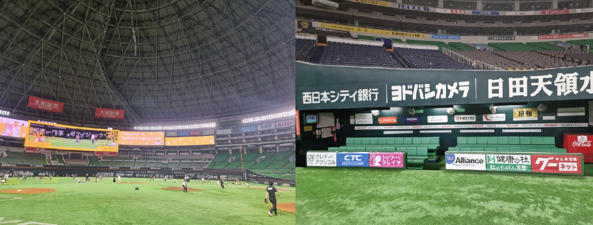
대략 이런식으로 구장에 들어가 보고 캐치볼이랑 여러가지 체험을 할 수 있는 곳이였는데 그냥 들어가서 야구만 봐도 재밌는 야구장에 잔디를 언제 밟아보겠어 !! 하는 마인드로 진짜 구장 열심히 뛰어 다녔다.

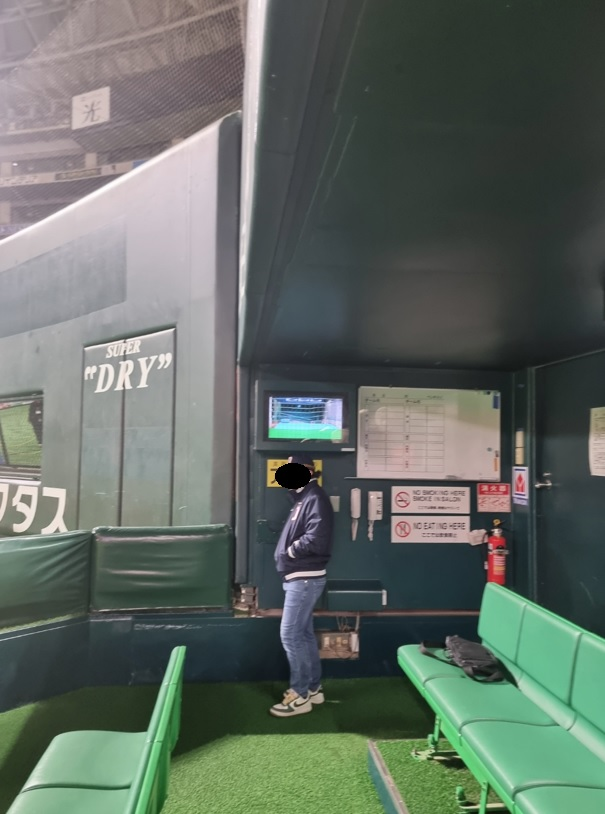
가자마자 자세부터 나오는 우리 감독님... 포스가 남다르더라

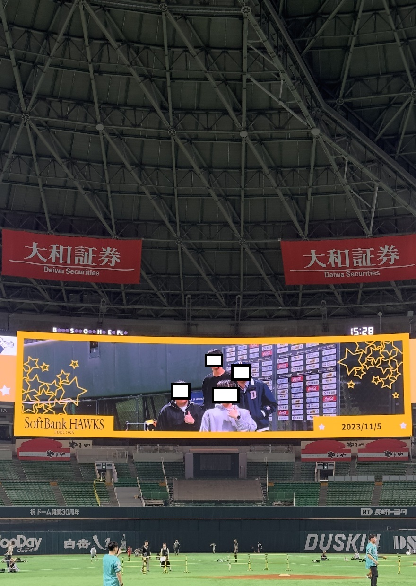
페이페이 돔 전광판은 우리가 점령했다 

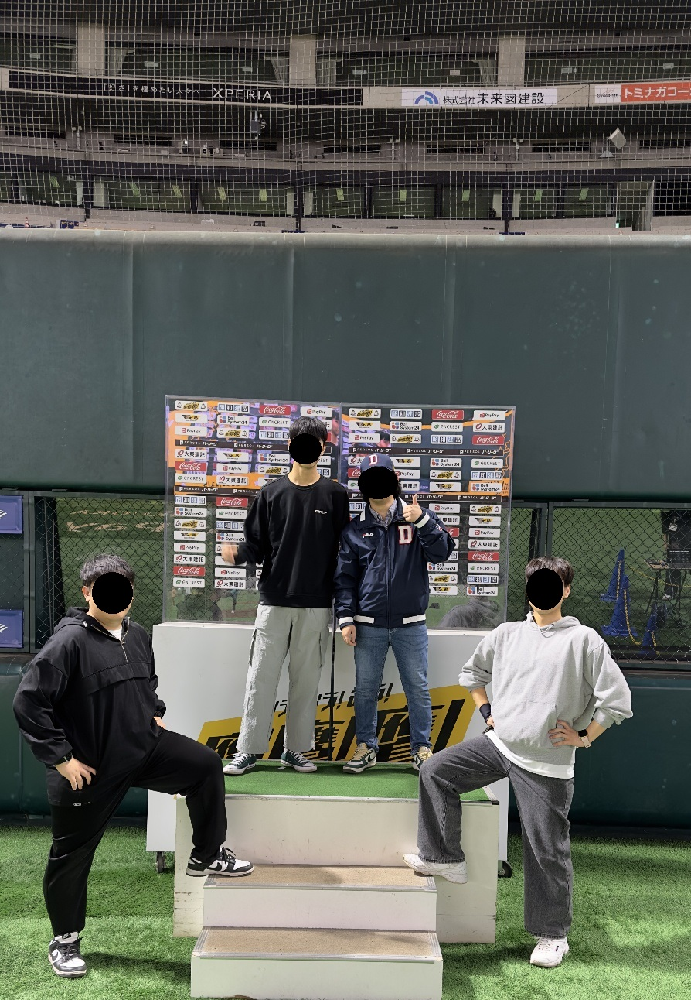
물론 단상도 같이 점령했다
